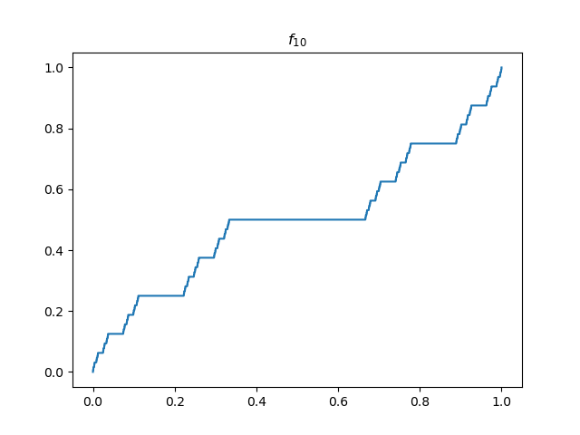

# The Cantor Function 

## Description 

The program `cantor.py` plots the sequence of functions used to generate the Cantor function, also known as the Devil's staircase. 

CantorFunction.pdf in this repo contains the description of the Cantor function. 

## Requirement 
The program uses the `matplotlib` library to generate plots. 
Get it with `pip install matplotlib` .

## Example Usage 
`python3 cantor.py` 

